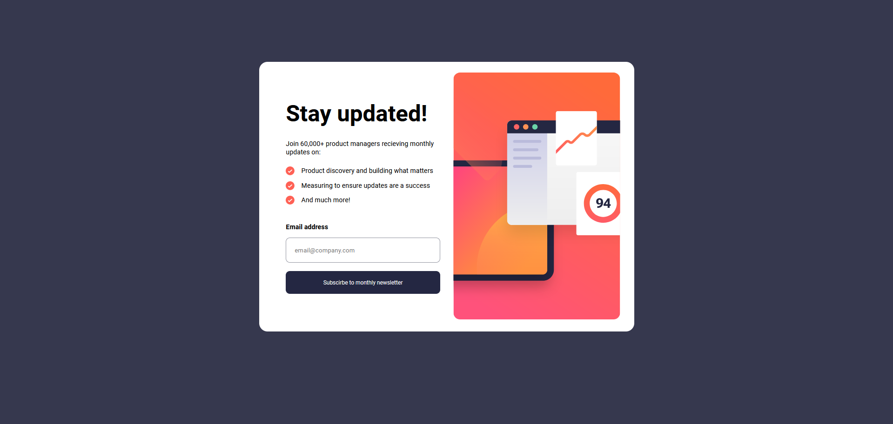
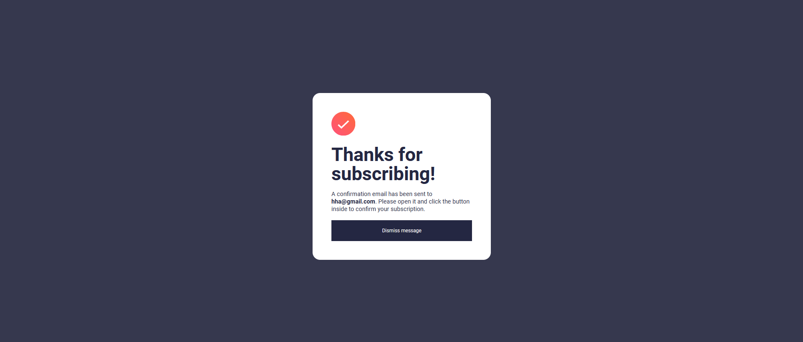
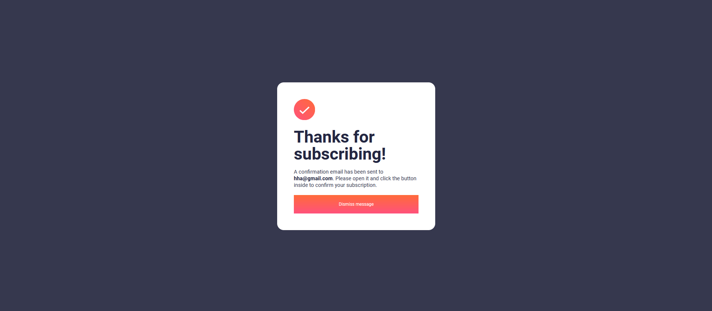
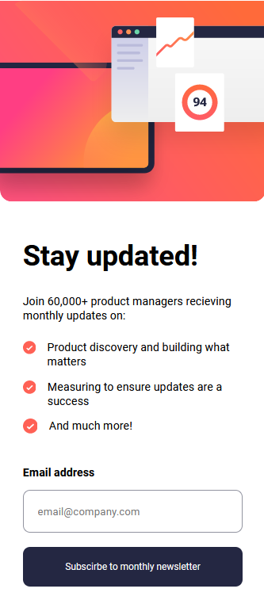

# Frontend Mentor - Newsletter sign-up form with success message solution

This is a solution to the [Newsletter sign-up form with success message challenge on Frontend Mentor](https://www.frontendmentor.io/challenges/newsletter-signup-form-with-success-message-3FC1AZbNrv). Frontend Mentor challenges help you improve your coding skills by building realistic projects. 

## Table of contents

- [Overview](#overview)
  - [The challenge](#the-challenge)
  - [Screenshot](#screenshot)
  - [Links](#links)
- [My process](#my-process)
  - [Built with](#built-with)
  - [What I learned](#what-i-learned)
- [Author](#author)

**Note: Delete this note and update the table of contents based on what sections you keep.**

## Overview

### The challenge

Users should be able to:

- Add their email and submit the form
- See a success message with their email after successfully submitting the form
- See form validation messages if:
  - The field is left empty
  - The email address is not formatted correctly
- View the optimal layout for the interface depending on their device's screen size
- See hover and focus states for all interactive elements on the page

### Screenshot







### Links

- Solution URL: [GitHub]([https://your-solution-url.com](https://github.com/induwara-thisarindu/Newsletter-sign-up-form-with-success-message))
- Live Site URL: [Live Demo]([https://your-live-site-url.com](https://newsletter-signup-form-wit-error-msg.netlify.app))

## My process

### Built with

- Semantic HTML5 markup
- CSS custom properties
- Flexbox
- CSS Grid
- Javascript

### What I learned

I learned about email validation

Some code I'm proud of

```js
const submitBtn = document.getElementById('submit-btn');
const form = document.getElementById('form');
const emailEl = document.getElementById('email');
const errorMessage = document.getElementById('error-msg');
const emailP = document.getElementById('email-holder');
const containerCard = document.getElementById('container');
const successCard = document.getElementById('card-container');
const dismissButton = document.getElementById('dismiss');

form.addEventListener('submit', (e) => {
    e.preventDefault();
    handleSubmit();
});

submitBtn.addEventListener('click', (e) => {
    handleSubmit();
});

function handleSubmit() {
    let emailValue = emailEl.value;

    if (emailValue === "") {
        errorMessage.innerHTML = "Please enter an email";
        emailEl.classList.toggle("error", true);
    } else if (!isEmail(emailValue)) {
        errorMessage.innerHTML = "Valid email required";
        emailEl.classList.toggle("error", true);
    } else {
        errorMessage.innerHTML = "";
        emailP.innerText = emailValue;
        emailEl.classList.toggle("error", false);
        containerCard.classList.add("display");
        successCard.classList.add("display-show");
    }
}

function isEmail(email) {
    const re = /^(([^<>()\[\]\\.,;:\s@"]+(\.[^<>()\[\]\\.,;:\s@"]+)*)|(".+"))@((\[[0-9]{1,3}\.[0-9]{1,3}\.[0-9]{1,3}\.[0-9]{1,3}])|(([a-zA-Z\-0-9]+\.)+[a-zA-Z]{2,}))$/;
    return re.test(String(email).toLowerCase());
}

dismissButton.addEventListener('click', (e) => {
    containerCard.classList.remove('display');
    successCard.classList.remove("display-show");

    emailEl.value = '';
})
```

## Author

- Name - Induwara Thisarindu

"# Newsletter-sign-up-form-with-success-message" 
